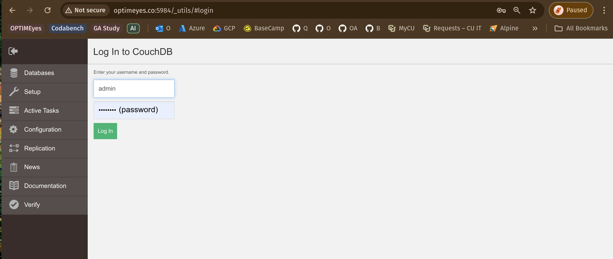
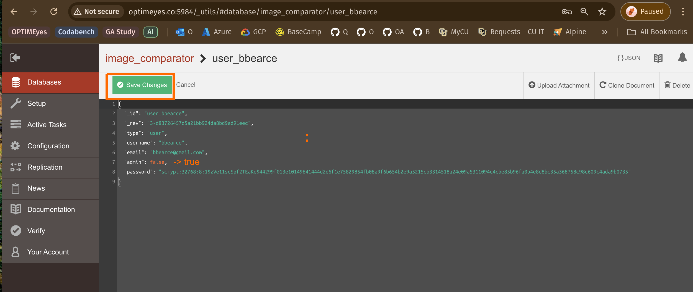
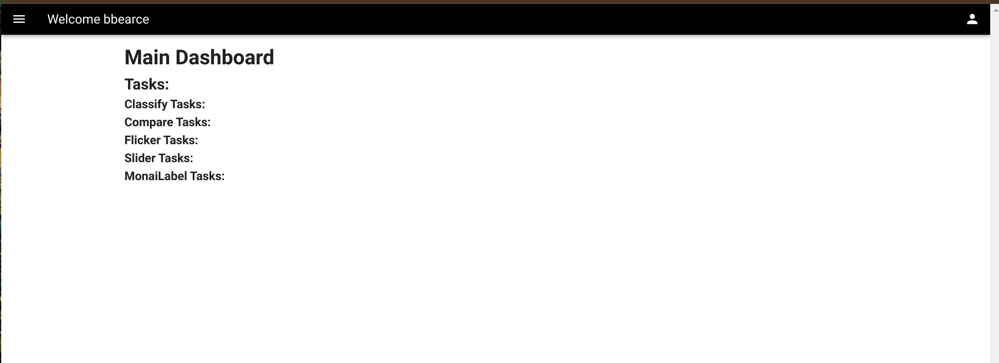
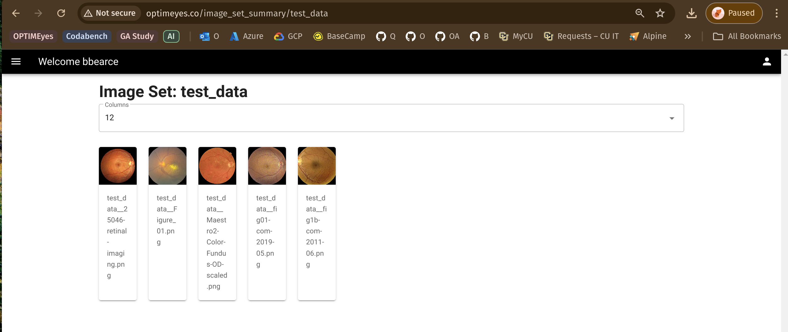
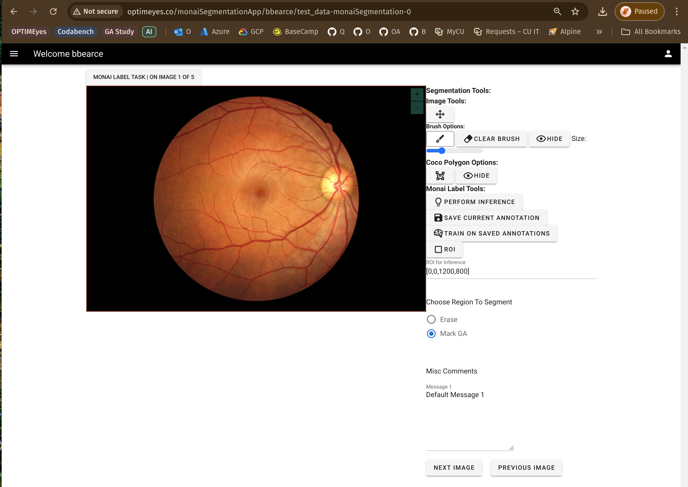

Click Sign Up:

Enter User Info:

Go To CouchDB Main Page:
> [http://0.0.0.0:5984/_utils](http://0.0.0.0:5984/_utils)

CouchDB Signin:

Click image_comparator DB:

Find and Click Users View:

Find Your User:

Set Admin to True and Save:

Save:

Back to Main Dashboard:

Navigate to Images Dashboard:

Upload Test Data Set Provided:

Look At Uploaded Data Set:

12 Column Grid View:

3 Column Grid View:

Navigate To Tasks:

Enter Task Definition:

Refresh Page and Click START/CONTINUE:

See Image:

